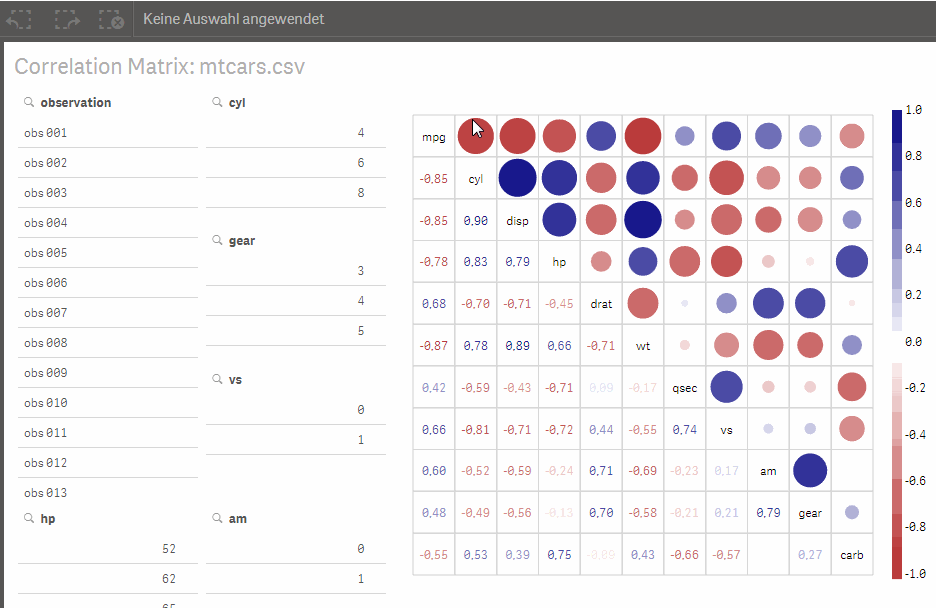

Qlik Sense Extensions Correlation Matrix
========================================

This extension visualizes correlation between all dimensions like in R using a dynamical created hypercube with n-measures for Qlik Sense function Correl() on all field combinations (amount: n*(n-1)/2).
First dimension is always a grouping dimension and not a value. At least two value dimensions needs to be used for one correlation.

Built with <a href="https://github.com/mbostock/d3">d3.js</a>, published with the MIT open-source license.

The example app uses the R built-in data set mtcars. This example creates 55 measures in the hypercube.